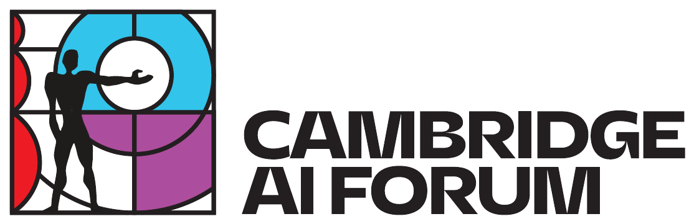
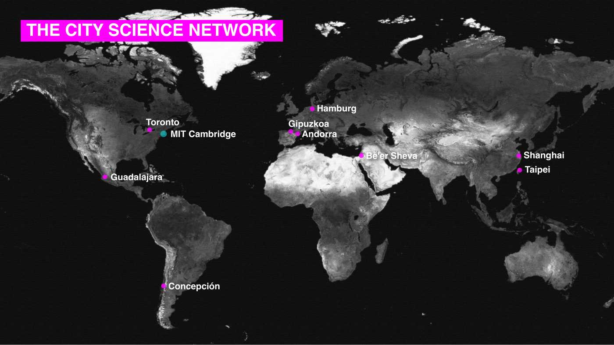
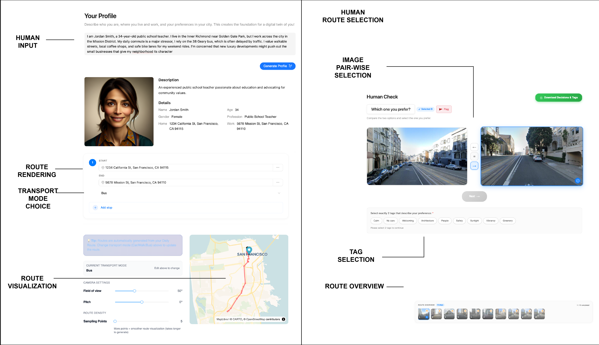
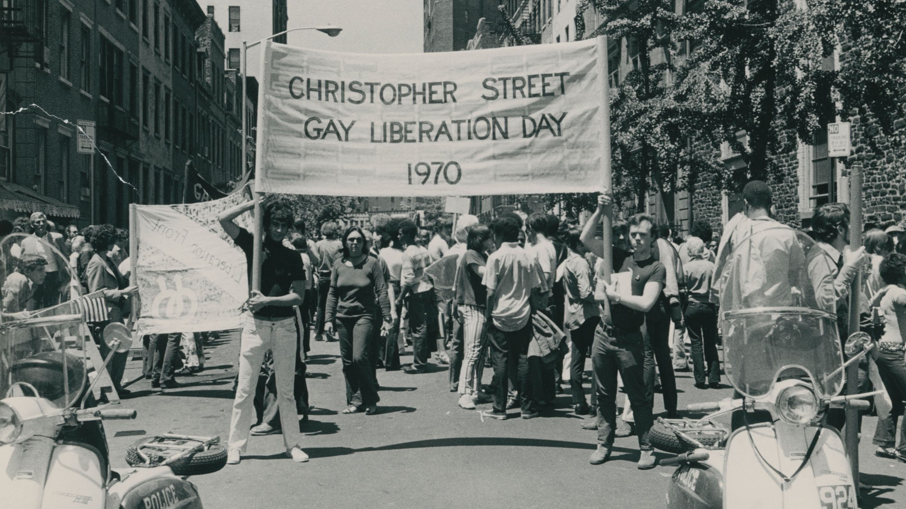

<!-- _class: title -->

Cambridge AI Forum · 2026-10-08

# Can AI agents live in tomorrow's city?

---

<!-- _class: about -->

# About me

<ul>
<li>Transport planning</li>
<li>PhD Student @ TU Munich</li>
<li>Research Affiliate @ MIT Media Lab City Science</li>
</ul>

---

<!-- _class: bleed -->

# The City Science Network

---

<!-- _class: bleed -->

# The city science process

<iframe class="yt-video" tabindex="-1" src="https://www.youtube.com/embed/lFXMshEGBSk?autoplay=1&mute=1&start=15&controls=1&rel=0" allow="autoplay; encrypted-media" allowfullscreen></iframe>

Ariel Noyman

---

<!-- _class: bleed -->

<iframe class="yt-video" tabindex="-1" src="https://www.youtube.com/embed/SyIRsLoWTgA?autoplay=1&mute=1&start=13&controls=1&rel=0" allow="autoplay; encrypted-media" allowfullscreen></iframe>

SimCity 2013

---

<!-- _class: statement -->

# Agents

---

<!-- _class: bleed -->

<iframe class="yt-video" tabindex="-1" src="https://www.youtube.com/embed/A-PEplqD0Ho?autoplay=1&mute=1&start=15&controls=1&rel=0" allow="autoplay; encrypted-media" allowfullscreen></iframe>

Vissum

---

<!-- _class: bleed -->

# Humanized agents

<iframe class="yt-video" tabindex="-1" src="https://www.youtube.com/embed/k8jp33HV9GA?autoplay=1&mute=1&start=0&controls=1&rel=0" allow="autoplay; encrypted-media" allowfullscreen></iframe>

Parfait Atchadé

---

<!-- _class: statement -->

# Agents &ne; Humans

---

<!-- _class: bleed -->

# Collecting human choices and thoughts

<iframe src="https://miguelurenapliego.github.io/ProjektAnlagenring/ABsurveys/web.html"></iframe>

---

<!-- _class: bleed -->

---

<!-- _class: bleed -->

<iframe src="https://miguelurenapliego.github.io/ProjektAnlagenring/ABsurveys/map.html"></iframe>

---

<!-- _class: bleed -->

# Expert knowledge

<video src="figures/viewer-demo.webm" autoplay loop muted playsinline></video>

---

<!-- _class: bleed -->

<iframe src="html/map/index.html"></iframe>

---

<!-- _class: ptitle -->

# Standarization

Boston

<iframe src="https://cs-futurecities.media.mit.edu/cs_transit_score/boston/"></iframe>

Taipei

<iframe src="https://cs-futurecities.media.mit.edu/cs_transit_score/taipei/"></iframe>

Guadalajara

<iframe src="https://cs-futurecities.media.mit.edu/cs_transit_score/guadalajara/"></iframe>

---

<svg viewBox="0 0 1000 630" width="100%" height="580">
  <defs>
    <marker id="arrowCyan" viewBox="0 0 10 10" refX="8" refY="5" markerWidth="7" markerHeight="7" orient="auto-start-reverse">
      <path d="M0,0 L10,5 L0,10 z" fill="#0DCAF2"/>
    </marker>
    <marker id="arrowMagenta" viewBox="0 0 10 10" refX="8" refY="5" markerWidth="7" markerHeight="7" orient="auto-start-reverse">
      <path d="M0,0 L10,5 L0,10 z" fill="#E40DF2"/>
    </marker>
  </defs>
  <path transform="translate(500,320) scale(1.3)" d="M -55 -55 L -15 -55 C -15 -75 15 -75 15 -55 L 55 -55 L 55 -15 C 75 -15 75 15 55 15 L 55 55 L 15 55 C 15 35 -15 35 -15 55 L -55 55 L -55 15 C -35 15 -35 -15 -55 -15 Z" fill="#D6534E" stroke="#231F20" stroke-width="2.5"/>
  <text x="500" y="326" text-anchor="middle" font-family="IBM Plex Sans" font-weight="700" font-size="18" fill="#FFFFFF" letter-spacing="1">MODEL</text>
  <path d="M 500 238 Q 516 176 500 115" fill="none" stroke="#0DCAF2" stroke-width="3" marker-end="url(#arrowCyan)"/>
  <path d="M 500 115 Q 484 176 500 238" fill="none" stroke="#E40DF2" stroke-width="3" marker-end="url(#arrowMagenta)"/>
  <text x="500" y="60" text-anchor="middle" dominant-baseline="middle" font-family="IBM Plex Sans" font-weight="600" font-size="24">Boston</text>
  <path d="M 544 251 Q 591 208 611 148" fill="none" stroke="#0DCAF2" stroke-width="3" marker-end="url(#arrowCyan)"/>
  <path d="M 611 148 Q 564 191 544 251" fill="none" stroke="#E40DF2" stroke-width="3" marker-end="url(#arrowMagenta)"/>
  <text x="641" y="101" text-anchor="start" dominant-baseline="middle" font-family="IBM Plex Sans" font-weight="600" font-size="24">Gipuzkoa</text>
  <path d="M 575 286 Q 637 275 686 235" fill="none" stroke="#0DCAF2" stroke-width="3" marker-end="url(#arrowCyan)"/>
  <path d="M 686 235 Q 624 246 575 286" fill="none" stroke="#E40DF2" stroke-width="3" marker-end="url(#arrowMagenta)"/>
  <text x="737" y="212" text-anchor="start" dominant-baseline="middle" font-family="IBM Plex Sans" font-weight="600" font-size="24">Andorra</text>
  <path d="M 581 332 Q 640 356 703 349" fill="none" stroke="#0DCAF2" stroke-width="3" marker-end="url(#arrowCyan)"/>
  <path d="M 703 349 Q 644 325 581 332" fill="none" stroke="#E40DF2" stroke-width="3" marker-end="url(#arrowMagenta)"/>
  <text x="757" y="357" text-anchor="start" dominant-baseline="middle" font-family="IBM Plex Sans" font-weight="600" font-size="24">Taipei</text>
  <path d="M 562 374 Q 598 426 655 454" fill="none" stroke="#0DCAF2" stroke-width="3" marker-end="url(#arrowCyan)"/>
  <path d="M 655 454 Q 619 402 562 374" fill="none" stroke="#E40DF2" stroke-width="3" marker-end="url(#arrowMagenta)"/>
  <text x="696" y="490" text-anchor="start" dominant-baseline="middle" font-family="IBM Plex Sans" font-weight="600" font-size="24">Beerseba</text>
  <path d="M 523 399 Q 525 462 558 517" fill="none" stroke="#0DCAF2" stroke-width="3" marker-end="url(#arrowCyan)"/>
  <path d="M 558 517 Q 556 453 523 399" fill="none" stroke="#E40DF2" stroke-width="3" marker-end="url(#arrowMagenta)"/>
  <text x="573" y="569" text-anchor="middle" dominant-baseline="middle" font-family="IBM Plex Sans" font-weight="600" font-size="24">Guadalajara</text>
  <path d="M 477 399 Q 444 453 442 517" fill="none" stroke="#0DCAF2" stroke-width="3" marker-end="url(#arrowCyan)"/>
  <path d="M 442 517 Q 475 462 477 399" fill="none" stroke="#E40DF2" stroke-width="3" marker-end="url(#arrowMagenta)"/>
  <text x="427" y="569" text-anchor="middle" dominant-baseline="middle" font-family="IBM Plex Sans" font-weight="600" font-size="24">Biobio</text>
  <path d="M 438 374 Q 381 402 345 454" fill="none" stroke="#0DCAF2" stroke-width="3" marker-end="url(#arrowCyan)"/>
  <path d="M 345 454 Q 402 426 438 374" fill="none" stroke="#E40DF2" stroke-width="3" marker-end="url(#arrowMagenta)"/>
  <text x="304" y="490" text-anchor="end" dominant-baseline="middle" font-family="IBM Plex Sans" font-weight="600" font-size="24">Hamburg</text>
  <path d="M 419 332 Q 356 325 297 349" fill="none" stroke="#0DCAF2" stroke-width="3" marker-end="url(#arrowCyan)"/>
  <path d="M 297 349 Q 360 356 419 332" fill="none" stroke="#E40DF2" stroke-width="3" marker-end="url(#arrowMagenta)"/>
  <text x="243" y="357" text-anchor="end" dominant-baseline="middle" font-family="IBM Plex Sans" font-weight="600" font-size="24">Shanghai</text>
  <path d="M 425 286 Q 376 246 314 235" fill="none" stroke="#0DCAF2" stroke-width="3" marker-end="url(#arrowCyan)"/>
  <path d="M 314 235 Q 363 275 425 286" fill="none" stroke="#E40DF2" stroke-width="3" marker-end="url(#arrowMagenta)"/>
  <text x="263" y="212" text-anchor="end" dominant-baseline="middle" font-family="IBM Plex Sans" font-weight="600" font-size="24">Toronto</text>
  <path d="M 456 251 Q 436 191 389 148" fill="none" stroke="#0DCAF2" stroke-width="3" marker-end="url(#arrowCyan)"/>
  <path d="M 389 148 Q 409 208 456 251" fill="none" stroke="#E40DF2" stroke-width="3" marker-end="url(#arrowMagenta)"/>
  <text x="359" y="101" text-anchor="end" dominant-baseline="middle" font-family="IBM Plex Sans" font-weight="600" font-size="24">San Francisco</text>
</svg>

---

<!-- _class: ptitle -->

# Algorithmic permitting

<svg viewBox="0 0 1000 380" width="100%" height="560">
  <defs>
    <marker id="arrow2" viewBox="0 0 10 10" refX="8" refY="5" markerWidth="7" markerHeight="7" orient="auto-start-reverse">
      <path d="M0,0 L10,5 L0,10 z" fill="#231F20"/>
    </marker>
    <marker id="arrowCyanB" viewBox="0 0 10 10" refX="8" refY="5" markerWidth="7" markerHeight="7" orient="auto-start-reverse">
      <path d="M0,0 L10,5 L0,10 z" fill="#0DCAF2"/>
    </marker>
    <marker id="arrowMagentaB" viewBox="0 0 10 10" refX="8" refY="5" markerWidth="7" markerHeight="7" orient="auto-start-reverse">
      <path d="M0,0 L10,5 L0,10 z" fill="#E40DF2"/>
    </marker>
  </defs>
  <g id="projectBox">
    <rect x="10" y="20" width="190" height="80" rx="8" fill="#FFFFFF" stroke="#0DCAF2" stroke-width="3"/>
    <text x="105" y="68" text-anchor="middle" font-family="IBM Plex Sans" font-weight="700" font-size="28">Project</text>
  </g>
  <g transform="translate(365,60) scale(1.15)">
    <path d="M -55 -55 L -15 -55 C -15 -75 15 -75 15 -55 L 55 -55 L 55 -15 C 75 -15 75 15 55 15 L 55 55 L 15 55 C 15 35 -15 35 -15 55 L -55 55 L -55 15 C -35 15 -35 -15 -55 -15 Z" fill="#D6534E" stroke="#231F20" stroke-width="2.5"/>
    <text x="0" y="-24" text-anchor="middle" font-family="IBM Plex Sans" font-weight="700" font-size="17" fill="#FFFFFF">Official City</text>
    <text x="0" y="30" text-anchor="middle" font-family="IBM Plex Sans" font-weight="700" font-size="17" fill="#FFFFFF">Model</text>
  </g>
  <rect x="540" y="20" width="170" height="80" rx="8" fill="#FFFFFF" stroke="#ED1C24" stroke-width="3"/>
  <text x="625" y="68" text-anchor="middle" font-family="IBM Plex Sans" font-weight="700" font-size="28">Community</text>
  <path d="M200 60 Q251 44 302 60" fill="none" stroke="#0DCAF2" stroke-width="3" marker-end="url(#arrowCyanB)"/>
  <path d="M302 60 Q251 76 200 60" fill="none" stroke="#E40DF2" stroke-width="3" marker-end="url(#arrowMagentaB)"/>
  <path d="M451 60 Q495 44 538 60" fill="none" stroke="#0DCAF2" stroke-width="3" marker-end="url(#arrowCyanB)"/>
  <path d="M538 60 Q495 76 451 60" fill="none" stroke="#E40DF2" stroke-width="3" marker-end="url(#arrowMagentaB)"/>
  <path d="M105 100 Q219 169 352 169" fill="none" stroke="#0DCAF2" stroke-width="3" marker-end="url(#arrowCyanB)"/>
  <path d="M352 169 Q238 100 105 100" fill="none" stroke="#E40DF2" stroke-width="3" marker-end="url(#arrowMagentaB)"/>
  <path d="M625 100 Q492 100 378 169" fill="none" stroke="#0DCAF2" stroke-width="3" marker-end="url(#arrowCyanB)"/>
  <path d="M378 169 Q511 169 625 100" fill="none" stroke="#E40DF2" stroke-width="3" marker-end="url(#arrowMagentaB)"/>
  <rect id="submissionRect" x="290" y="150" width="150" height="40" rx="6" fill="#FFFFFF" stroke="#231F20" stroke-width="1.5"/>
  <animate href="#submissionRect" attributeName="stroke" values="#231F20;#231F20;#D6534E;#231F20;#231F20" keyTimes="0;0.40;0.44;0.5;1" dur="10s" repeatCount="indefinite"/>
  <text x="365" y="177" text-anchor="middle" font-family="IBM Plex Mono" font-size="22" fill="#231F20">Submission</text>
  <line x1="365" y1="190" x2="365" y2="245" stroke="#231F20" stroke-width="2.5" marker-end="url(#arrow2)"/>
  <circle id="approvalCircle" cx="338" cy="278" r="19" fill="#DC2626"/>
  <animate href="#approvalCircle" attributeName="fill" values="#DC2626;#DC2626;#16A34A;#16A34A;#DC2626" keyTimes="0;0.40;0.46;0.94;1" dur="10s" repeatCount="indefinite"/>
  <path id="approvalX" d="M329 269 L347 287 M347 269 L329 287" fill="none" stroke="#FFFFFF" stroke-width="3.4" stroke-linecap="round"/>
  <animate href="#approvalX" attributeName="opacity" values="1;1;0;0;1" keyTimes="0;0.40;0.46;0.94;1" dur="10s" repeatCount="indefinite"/>
  <path id="approvalCheck" d="M329 278 L336 286 L349 269" fill="none" stroke="#FFFFFF" stroke-width="3.8" stroke-linecap="round" stroke-linejoin="round"/>
  <animate href="#approvalCheck" attributeName="opacity" values="0;0;1;1;0" keyTimes="0;0.40;0.46;0.94;1" dur="10s" repeatCount="indefinite"/>
  <text x="366" y="286" text-anchor="start" font-family="IBM Plex Mono" font-size="26" font-weight="600" fill="#231F20">Approval</text>
  <text x="720" y="36" font-family="IBM Plex Sans" font-weight="700" font-size="22">Community priorities</text>
  <g id="listBefore">
    <animate attributeName="opacity" values="1;1;0;0;1" keyTimes="0;0.38;0.46;0.94;1" dur="10s" repeatCount="indefinite"/>
    <text x="720" y="94" font-family="IBM Plex Sans" font-weight="700" font-size="21" fill="#E40DF2">1. Supermarket</text>
    <text x="720" y="139" font-family="IBM Plex Sans" font-size="21">2. Daycare</text>
    <text x="720" y="184" font-family="IBM Plex Sans" font-size="21">3. Park</text>
    <text x="720" y="229" font-family="IBM Plex Sans" font-size="21">4. School</text>
    <text x="720" y="274" font-family="IBM Plex Sans" font-size="21">5. Community center</text>
  </g>
  <g id="listAfter">
    <animate attributeName="opacity" values="0;0;1;1;0" keyTimes="0;0.38;0.46;0.94;1" dur="10s" repeatCount="indefinite"/>
    <text x="720" y="94" font-family="IBM Plex Sans" font-size="19" fill="#6b6668" text-decoration="line-through">Supermarket</text>
    <text x="720" y="139" font-family="IBM Plex Sans" font-size="21">1. Daycare</text>
    <text x="720" y="184" font-family="IBM Plex Sans" font-size="21">2. Park</text>
    <text x="720" y="229" font-family="IBM Plex Sans" font-size="21">3. School</text>
    <text x="720" y="274" font-family="IBM Plex Sans" font-size="21">4. Community center</text>
  </g>
  <g id="token" opacity="0">
    <animateTransform attributeName="transform" type="translate" values="0,0; 0,0; -431,80; -431,80; 0,0" keyTimes="0;0.10;0.40;0.46;1" dur="10s" repeatCount="indefinite"/>
    <animate attributeName="opacity" values="0;1;1;0;0" keyTimes="0;0.06;0.40;0.46;1" dur="10s" repeatCount="indefinite"/>
    <rect x="712" y="75" width="168" height="30" rx="15" fill="#E40DF2"/>
    <text x="796" y="96" text-anchor="middle" font-family="IBM Plex Sans" font-weight="700" font-size="19" fill="#FFFFFF">Supermarket</text>
  </g>
</svg>

---

<!-- _class: statement -->

# Models have authors

---

<!-- _class: bleed -->

---

<!-- _class: bleed -->

---

<!-- _class: statement -->

# People decide the future

---

<!-- _class: closing -->

LinkedIn

# Thank you

Questions?

<a href="https://www.linkedin.com/in/miguel-urena-pliego">linkedin.com/in/miguel-urena-pliego</a>
<a href="https://github.com/MiguelUrenaPliego">github.com/MiguelUrenaPliego</a>
<a href="https://miguelurenapliego.github.io/CambridgeAIForum2026/">miguelurenapliego.github.io/CambridgeAIForum2026</a>

Slides

